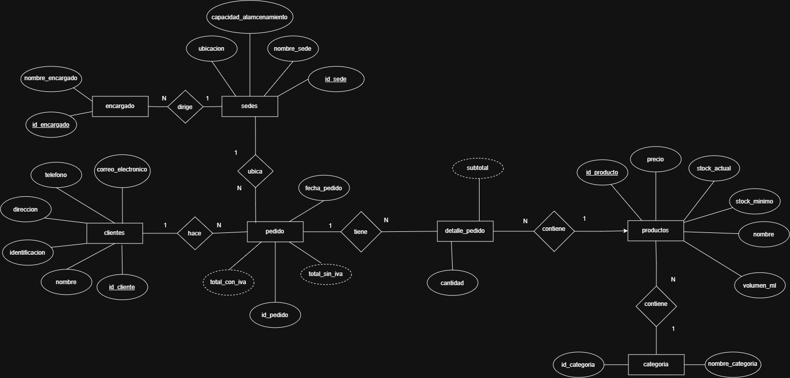
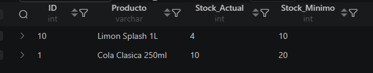
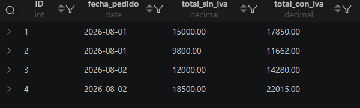
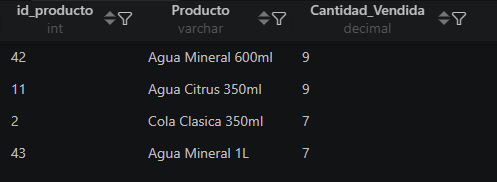
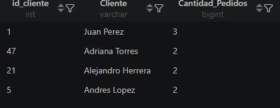

# Distribuidora de Gaseosas del Valle S.A.

## 📋 Descripción del proyecto

El presente proyecto consiste en el diseño e implementación de una **base de datos relacional para la gestión de la Distribuidora de Gaseosas del Valle S.A.**

El sistema tiene como objetivo organizar y controlar la información relacionada con **clientes, productos, pedidos, sedes y encargados**, permitiendo administrar de manera estructurada las operaciones principales de la empresa.

La implementación de la base de datos busca mejorar la organización de la información, reducir errores en el registro de datos, facilitar la consulta de información y mantener un mayor control sobre los productos y pedidos realizados.

El proyecto fue desarrollado utilizando **MySQL**, aplicando conceptos de bases de datos relacionales como:

* Tablas y relaciones.
* Claves primarias y foráneas.
* Restricciones (`CONSTRAINTS`).
* Funciones almacenadas.
* Triggers.
* Vistas.
* Consultas SQL.
* Control de stock.
* Auditoría de cambios.

---

## 🗂️ Tecnologías utilizadas

| Tecnología             | Uso                                         |
| ---------------------- | ------------------------------------------- |
| MySQL                  | Sistema gestor de base de datos             |
| SQL                    | Creación, manipulación y consulta de datos  |
| MySQL Workbench        | Diseño y administración de la base de datos |
| diagrams.net / Draw.io | Elaboración del modelo entidad-relación     |

---

## 🧩 Modelo Entidad-Relación

El modelo entidad-relación representa la estructura lógica de la base de datos y las relaciones existentes entre las diferentes entidades del sistema.



### Principales entidades

Entre las principales entidades utilizadas en el sistema se encuentran:

* **Clientes:** almacena la información de los clientes de la distribuidora.
* **Productos:** contiene los productos disponibles para la venta y su información correspondiente.
* **Categorías:** permite clasificar los productos.
* **Pedidos:** registra los pedidos realizados por los clientes.
* **Detalle de pedidos:** almacena los productos incluidos en cada pedido.
* **Sedes:** registra las diferentes sedes de la empresa.
* **Encargados:** almacena la información de los responsables de las sedes.

Las relaciones entre estas entidades permiten mantener la integridad y consistencia de la información almacenada.

---

# ⚙️ Funciones y Triggers

El sistema utiliza funciones almacenadas y triggers para automatizar operaciones importantes dentro de la base de datos.

## 🔹 Funciones almacenadas

### 1. `fn_calcular_total_con_iva`

Esta función permite calcular el **total de un pedido incluyendo el IVA**.

Recibe como parámetro el identificador del pedido y obtiene la suma de los subtotales registrados en la tabla `detalle_pedidos`.

Posteriormente, aplica el porcentaje de IVA correspondiente para obtener el total final.

**Objetivo principal:**

* Calcular automáticamente el total de un pedido.
* Evitar realizar manualmente las operaciones.
* Centralizar el cálculo del total dentro de la base de datos.
* Facilitar la reutilización del cálculo en diferentes consultas.

**Parámetro:**

```sql
p_id_pedido INT
```

**Retorna:**

```sql
DECIMAL(10,2)
```

**Ejemplo de utilización:**

```sql
SELECT fn_calcular_total_con_iva(1) AS total_con_iva;
```

---

### 2. `fn_validar_stock`

Esta función permite **validar la disponibilidad de un producto en el inventario** antes de realizar determinadas operaciones relacionadas con los pedidos.

Su finalidad es comprobar que exista una cantidad suficiente de unidades disponibles para satisfacer la cantidad solicitada.

**Objetivo principal:**

* Comprobar la disponibilidad de productos.
* Evitar operaciones que superen el stock existente.
* Mejorar el control del inventario.
* Facilitar la validación desde las consultas y procesos de la base de datos.

La función contribuye a mantener la consistencia de los datos relacionados con el inventario.

---

# 🔄 Triggers

Los triggers permiten ejecutar automáticamente determinadas acciones cuando ocurre un evento sobre una tabla.

## 1. `tr_actualizar_stock`

Este trigger se ejecuta cuando se registra un nuevo detalle de pedido.

Su función principal es **descontar automáticamente del stock del producto la cantidad solicitada en el pedido**.

### Funcionamiento

Cuando se inserta un registro en `detalle_pedidos`:

1. Se identifica el producto solicitado.
2. Se obtiene la cantidad registrada.
3. Se descuenta dicha cantidad del stock disponible.
4. El nuevo stock queda actualizado automáticamente.

### Objetivo

Evitar que el usuario tenga que modificar manualmente el inventario después de cada pedido.

Ejemplo conceptual:

```text
Stock inicial
      ↓
Registro de detalle del pedido
      ↓
Trigger tr_actualizar_stock
      ↓
Descuento automático
      ↓
Stock actualizado
```

---

## 2. `tr_auditar_cambio_precio`

Este trigger permite llevar un registro de los cambios realizados sobre el precio de los productos.

Cuando se modifica el precio de un producto, el trigger registra la información correspondiente en la tabla `auditoria_precios`.

La auditoría almacena información como:

* Fecha del cambio.
* Precio anterior.
* Precio nuevo.
* Producto afectado.

### Objetivo

Mantener un historial de modificaciones de precios para facilitar el seguimiento y control de los cambios realizados en el sistema.

Ejemplo conceptual:

```text
Precio anterior
      ↓
Actualización del producto
      ↓
Trigger tr_auditar_cambio_precio
      ↓
Registro en auditoria_precios
      ↓
Historial del cambio
```

---

# 👁️ Vistas

Además de las funciones y triggers, el sistema cuenta con vistas para facilitar la consulta de información.

## `vista_resumen_pedidos_por_sede`

Permite obtener un resumen de los pedidos asociados a cada sede.

Esta vista facilita el análisis de la cantidad de pedidos gestionados por las diferentes sedes de la empresa.

Ejemplo:

```sql
SELECT *
FROM vista_resumen_pedidos_por_sede;
```

---

## `vista_productos_bajo_stock`

Permite identificar los productos que tienen una cantidad de inventario considerada baja.

Esta información puede utilizarse para detectar productos que requieren reposición.

Ejemplo:

```sql
SELECT *
FROM vista_productos_bajo_stock;
```

---

## `vista_clientes_activos`

Permite consultar los clientes que mantienen actividad dentro del sistema.

Esta vista facilita la identificación de clientes que han realizado operaciones o pedidos registrados.

Ejemplo:

```sql
SELECT *
FROM vista_clientes_activos;
```

---

# 🔎 Ejemplos de consultas

A continuación se presentan algunos ejemplos de consultas utilizadas para comprobar el funcionamiento de la base de datos.

## Consulta 1 — Mostrar todos los clientes

```sql
SELECT *
FROM clientes;
```

Permite consultar todos los clientes registrados en el sistema.

---

## Consulta 2 — Mostrar productos disponibles

```sql
SELECT *
FROM productos;
```

Permite visualizar los productos registrados junto con su información correspondiente.

---

## Consulta 3 — Consultar productos con bajo stock

```sql
SELECT *
FROM vista_productos_bajo_stock;
```

Permite identificar rápidamente los productos que requieren atención por presentar una cantidad reducida en inventario.

---

## Consulta 4 — Consultar resumen de pedidos por sede

```sql
SELECT *
FROM vista_resumen_pedidos_por_sede;
```

Permite analizar la distribución de pedidos entre las diferentes sedes.

---

## Consulta 5 — Calcular el total de un pedido con IVA

```sql
SELECT fn_calcular_total_con_iva(1) AS total_con_iva;
```

Esta consulta utiliza la función `fn_calcular_total_con_iva` para calcular automáticamente el total correspondiente al pedido indicado.

---

# 📸 Evidencias y resultados

En esta sección se pueden incluir capturas de pantalla que demuestren el funcionamiento de las consultas.

### Consultar los productos con stock por debajo del mínimo.



### Consultar los pedidos realizados entre dos fechas (BETWEEN).



### Listar los productos más vendidos (con JOIN y GROUP BY).



### Mostrar clientes y la cantidad de pedidos realizados.




---

# 📁 Estructura del proyecto

Una estructura recomendada para organizar el repositorio es:

```text
db_distribuidora_de_gaseosas_del_valle/
│
├── ddl/
│   ├── 01_schema.sql
│   └── 02_indices.sql
│
├── dml/
│   ├── 01_clientes.sql
│   ├── 02_categorias.sql
│   ├── 03_productos.sql
│   ├── 04_encargados_sedes.sql
│   ├── 05_sedes.sql
│   ├── 06_pedidos.sql
│   ├── 07_detalles_pedido.sql
│   └── 08_auditoria_precio.sql
│
├── docs/
│
├── dql/
│   ├── funciones.sql
│   ├── queries.sql
│   ├── trigger.sql
│   └── views.sql
│
├── evidencias/
│   └── img/
│       ├── 1ra_consulta.png
│       ├── 2da_consulta.png
│       ├── 3ra_consulta.png
│       └── 4ta_consulta.png
│
├── img/
│   └── db_distribuidora_de_gaseosas_del_valle_SA.jpg
│
└── README.md

```

---

# 🚀 Recomendaciones para la expansión futura

El sistema puede ampliarse posteriormente para cubrir una mayor cantidad de procesos de la empresa.

### 1. Gestión de proveedores

Agregar una sección para registrar proveedores y relacionarlos con los productos adquiridos.

Esto permitiría controlar:

* Proveedores.
* Compras.
* Costos de adquisición.
* Fechas de compra.
* Historial de proveedores.

### 2. Control de inventario avanzado

Implementar un sistema más completo de movimientos de inventario que registre:

* Entradas.
* Salidas.
* Ajustes.
* Devoluciones.
* Fechas de movimiento.
* Usuario responsable.

### 3. Sistema de usuarios y permisos

Agregar usuarios con diferentes niveles de acceso, por ejemplo:

* Administrador.
* Encargado.
* Vendedor.
* Supervisor.

Esto permitiría controlar qué operaciones puede realizar cada usuario.

### 4. Historial de pedidos

Implementar un sistema de seguimiento de estados de los pedidos:

```text
Pendiente
    ↓
Confirmado
    ↓
Preparando
    ↓
Enviado
    ↓
Entregado
```

Esto facilitaría el seguimiento de cada pedido.

### 5. Reportes y estadísticas

Crear nuevas vistas o procedimientos para generar reportes sobre:

* Productos más vendidos.
* Clientes con mayor cantidad de pedidos.
* Ventas por período.
* Ventas por sede.
* Productos con mayor rotación.
* Productos con bajo stock.

### 6. Aplicación web

Como una futura etapa, la base de datos podría integrarse con una aplicación web que permita administrar la información mediante una interfaz gráfica.

La aplicación podría incluir módulos para:

* Clientes.
* Productos.
* Pedidos.
* Inventario.
* Sedes.
* Reportes.
* Usuarios.

---

# 🎯 Conclusión

La base de datos de **Distribuidora de Gaseosas del Valle S.A.** proporciona una estructura organizada para administrar la información relacionada con las principales operaciones de la empresa.

La utilización de **funciones, triggers y vistas** permite automatizar procesos, reducir errores y facilitar el acceso a información relevante.

Las funciones permiten reutilizar operaciones como el cálculo de totales y la validación de stock, mientras que los triggers automatizan procesos como la actualización del inventario y la auditoría de cambios de precios.

Finalmente, el sistema cuenta con una estructura que puede ampliarse en el futuro mediante nuevos módulos, reportes, usuarios y una aplicación que permita interactuar con la base de datos de manera visual.

---

## 👨‍💻 Autor

**Lucas Pajarito**

Proyecto académico de base de datos desarrollado con **MySQL**.
