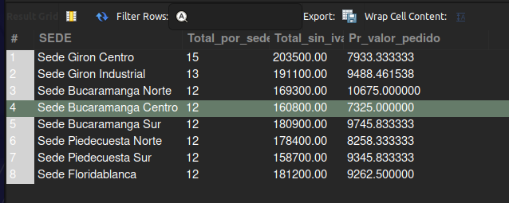

## Examen (1H) Análisis de datos

## Descripción.

El siguiente esxamen contienes un analisis de datos riguroso, que permite visualizar datos importates de una base de datos de  la empresa Gaseosas del Valle S.A.

## Requerimientos
Debes realizar las siguientes tareas:

- Crear una función MySQL llamada 
    calcular_promedio_pedidos_cliente que: 
    Reciba como parámetro el ID de un cliente.
    Retorne el promedio del total (sin IVA) de todos los pedidos realizados por ese cliente.
    Si el cliente no tiene pedidos, retorne 0.


- Crear una vista llamada vista_resumen_sedes que:
    Muestre por cada sede:
        Nombre de la sede
        Cantidad total de pedidos despachados
        Valor total vendido (sin IVA)
        Promedio de valor por pedido
        La vista debe usar JOIN entre pedidos y sedes, y agrupar correctamente los resultados.

- Realizar una consulta con subconsulta que:
    Muestre el nombre del producto, categoría y stock
    Solo incluya los productos cuyo precio sea mayor al promedio general de precios de todos los productos.

    Crear un trigger llamado auditar_cambio_precio que:
    Se ejecute después de un UPDATE en la tabla de productos.


- Registre en una tabla auditoria_precios los campos:
    id_producto, precio_anterior, precio_nuevo, fecha_modificacion.
    Solo se debe registrar si el precio realmente cambió.

## Modo de ejecución

1. Crea toda las tablas que se encuentran en ddl/01_schma.sql
2. inserte los datos correspondientes.
3. ejeute cada una de las funcines, triggers y consultas solicitadas.

## Ejemplo de vista.

- la sigueinte imagen presenta los resultados de la vista requeirda.

```sql
DROP view vista_resumen_sedes;

select * FROM vista_resumen_sedes;

CREATE view vista_resumen_sedes AS
	SELECT S.nombre_sede AS SEDE, count(P.id_sede) AS Total_por_sede, 
		   sum(P.total_sin_iva) Total_sin_iva, avg(DP.subtotal) AS Pr_valor_pedido
		FROM sedes S INNER JOIN pedidos P
        ON S.id_sede = P.id_sede INNER JOIN detalle_pedidos DP
        ON P.id_pedido = DP.id_pedido
        group by nombre_sede;

```

